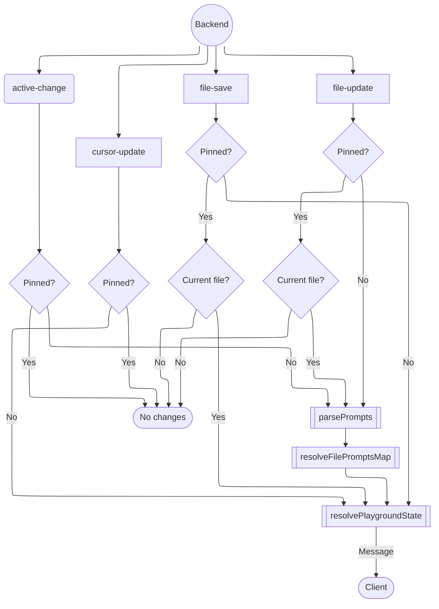
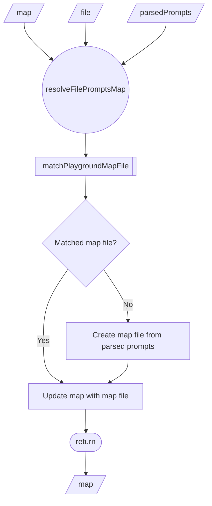
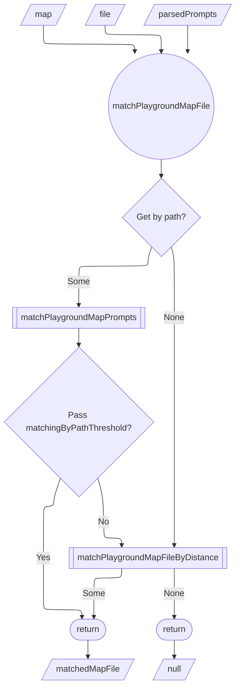
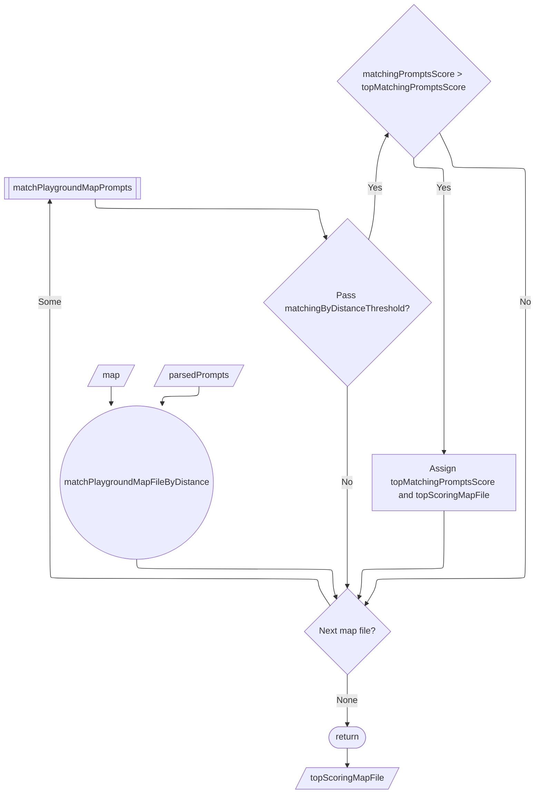
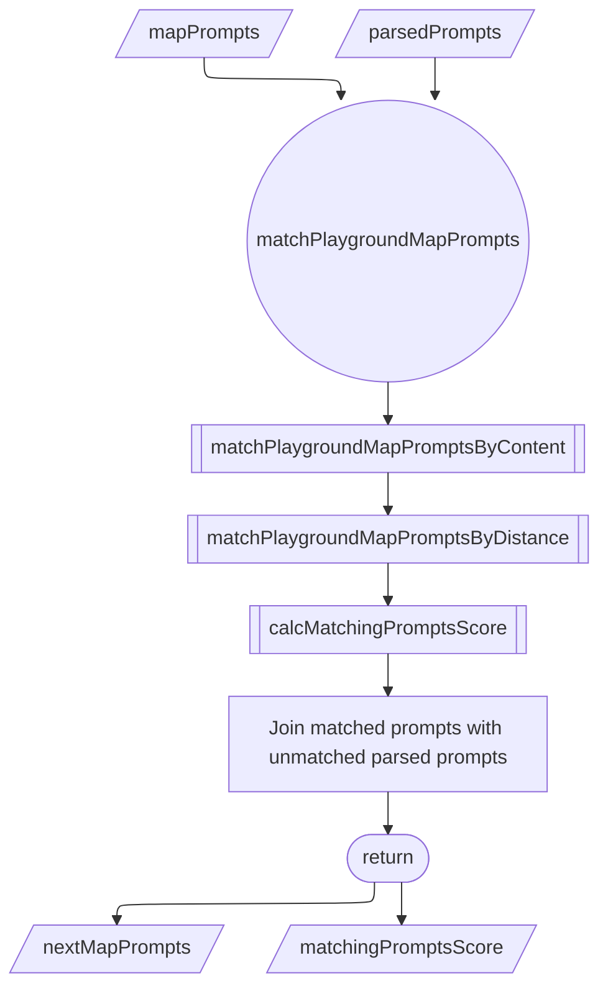
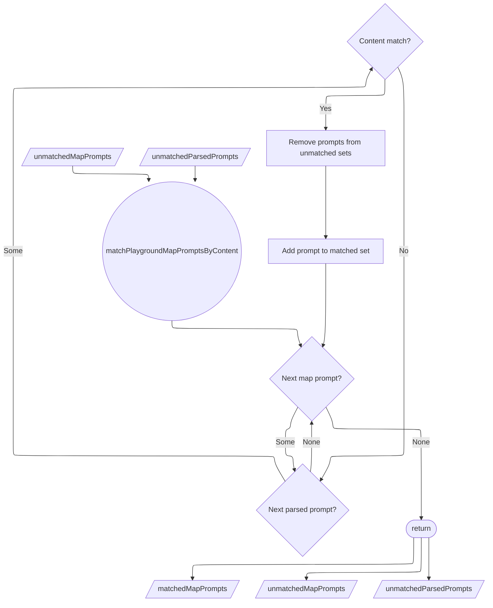
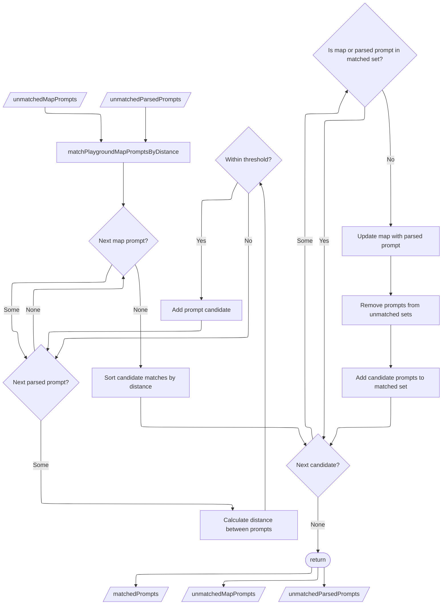

# Playground State Resolve

This document describes the playground state calculation algorithm.

## Context

When an active file, cursor selection, or file content changes, it needs to be reflected in the UI. Since user input needs to be preserved and restored when moving the cursor or updating the active prompt, we need to reliably associate the settings with a particular prompt.

We can't rely on the prompt content as the identifier, as it might change. We also can't rely on the prompt index, as prompts might be reordered or new ones added to the beginning of the file.

So to address that, we use a combination of heuristics to identify the correct prompt playground state.

## High-Level Flow

The diagram bellow illustrates how different backend events trigger used to resolve the playground state.

## Role of the Map

The idea of the map is to maintain a stable association between prompts and their playground state across file edits. Essentially it exists only to obtain the correct prompt reference (file and prompt IDs) to load the playground state from.

## Contracts

The VS Code extension and the webview exchange a canonical `PlaygroundState` payload exported from `@wrkspc/core/playground`. Playground state only contains prompt identifiers, trimmed previews, and the chosen prompt entry. The resolver tracks richer history inside `PlaygroundMap`, also exported from `@wrkspc/core/playground`, which maintains per-file prompt IDs, contents, and timestamps. `PlaygroundMap` never leaves the extension process; it is used to derive `PlaygroundState` snapshots emitted via the `VscMessagePlayground` message channel.

## Algorithms

### `resolveFilePromptsMap`

The function takes in the current `map`, `parsedPrompts`, and `file` state as inputs. It resolves the map by matching file and prompts and returns the updated `map`.

### `matchPlaygroundMapFile`

The function takes in `map`, `parsedPrompts`, and `file` as inputs. It uses the file path and the parsed prompts to find the corresponding map entry. If a match is found, it returns the `matchedMapFile`, otherwise returns `null`.

### `matchPlaygroundMapFileByDistance`

The function takes in `map` and `parsedPrompts` as inputs. It finds the top scoring map file by matching prompts score and returns the `topScoringMapFile` if it meets the threshold, otherwise returns `null`.

### `matchPlaygroundMapPrompts`

The function takes in `mapPrompts` and `parsedPrompts` as inputs. It matches prompts by content and then by distance, returning `matchedPrompts`, `unmatchedMapPrompts`, and `unmatchedParsedPrompts` sets as well as matching score `matchingScore`.

### `matchPlaygroundMapPromptsByContent`

The function takes in `unmatchedMapPrompts` and `unmatchedParsedPrompts` sets as inputs. It iterates through both sets to find exact content matches and returns `matchedMapPrompts`, `unmatchedMapPrompts`, and `unmatchedParsedPrompts` sets.

### `matchPlaygroundMapPromptsByDistance`

The function takes in `unmatchedMapPrompts` and `unmatchedParsedPrompts` sets as inputs. It uses levenshtein distance to find the closest matches and returns `matchedPrompts`, `unmatchedMapPrompts`, and `unmatchedParsedPrompts` sets.

